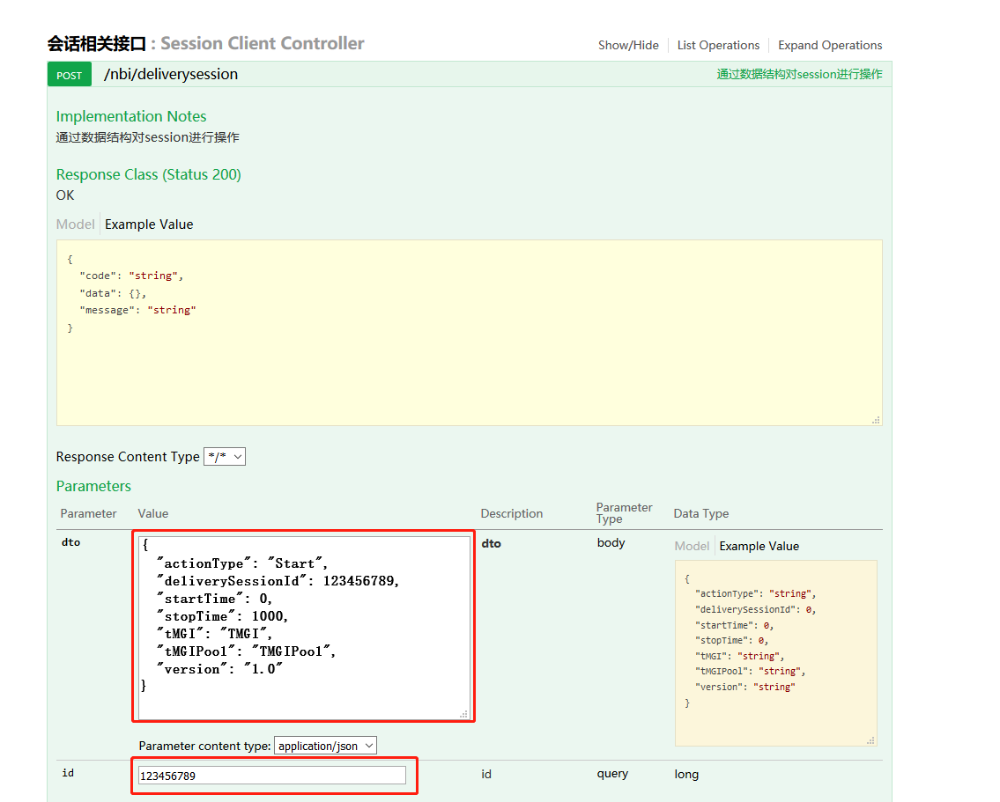
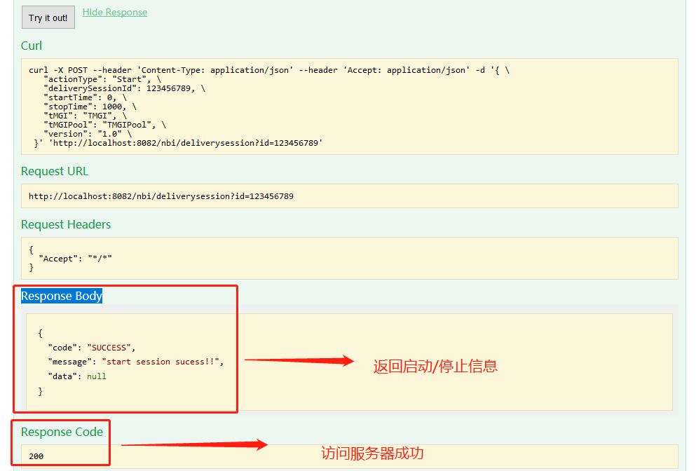
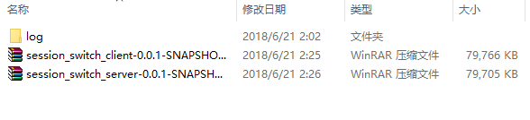

# springboot_jpa基础代码

#### 项目介绍

本项目由Client与Server组成

**Client**： 

调用远程服务端模拟开启停止会话(Session)

实现功能：

1. 根据json格式的数据结构，使用RestTemplate调用Server的接口。
2. 用于执行session的Start与Stop功能
3. 使用slf4j记录Session状态，日志暂存于相对路径log/session/session_switch.log
4. 开启独立线程，使用timer计时器延迟访问session关闭接口
5. 使用hibernate-valid 校验传入json参数

待实现功能思路：

1. 使用MQ替代restTemplate实现异步发送
2. 使用nginx或者使用Ribbon搭配eureka实现负载均衡机制，解决高并发问题
3. 使用统一异常处理代替手工异常处理（时间原因只实现了简单的手工校验以及异常捕捉）
4. 使用ThreadLocal记录正在执行的Timer的Thread信息，从而实现优雅停止的功能

**Server**：
简单的返回了执行成功的统一返回对象。


#### 软件架构

springBoot 1.5.10.RELEASE + JDK1.8 + swagger

#### 安装教程

1. 需要jdk1.8环境
2. jar包已经打包在根目录下的jar文件夹下

#### 使用说明

1. 在根目录下jar文件夹找到jar包
2. 在cmd窗口下依次执行
	- java -jar session_switch_server-0.0.1-SNAPSHOT.jar
	- java -jar session_switch_client-0.0.1-SNAPSHOT.jar
3. 访问客户端端口 http://localhost:8082/swagger-ui.html
4. 打开会话相关接口 -> /nbi/deliverysession -> Parameters 在dto 窗口中填入开启参数
	```
	{
	  "actionType": "Start",
	  "deliverySessionId": 123456789,
	  "startTime": 0,
	  "stopTime": 1000,
	  "tMGI": "TMGI",
	  "tMGIPool": "TMGIPool",
	  "version": "1.0"
	}
	```
- 如需测试Stop, 将dto数据结构修改为
```
{
  "actionType": "Stop",
  "deliverySessionId": 123456789,
  "startTime": 0,
  "stopTime": 1000,
  "tMGI": "TMGI",
  "tMGIPool": "TMGIPool",
  "version": "1.0"
}
```

5. 在id输入栏填入123456789
6. 点击Try it out! 进行测试
7. Try it out! 下方显示的Response Code: 200 表示测试通过, 并在Response Body中返回相关信息

8. 访问成功jar包相对路径下产生相应log文件



#### 参与贡献
#### 码云特技
